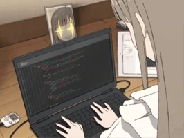

<div align="center">

#   Hey, I'm Siddhesh Bala 👋
<br><br>


<br><br>
 



</div>

---

#  About Me

🎓 AI & Data Science Student

💻 Learning Python, NumPy, Pandas & Matplotlib

🌱 Currently building a strong programming foundation before diving into AI & Machine Learning

📚 I believe in learning by building projects and documenting everything on GitHub.

🎯 Goal: Become a skilled AI Engineer and contribute to impactful projects

---

#   Tech Stack

<p align="center">


</p>

#   Other Platforms

<p align="center">

<a href="https://exercism.org/profiles/Siddhesh2008" target="_blank">
  
</a>
<a href="https://instagram.com/zoro_d.sid">
  
</a>
<a href="https://www.roblox.com/users/1514841623/profile">
  
</a>

</p>

---

#   Currently Learning

```text
🐍 Python           ████████░░ 80%
🔢 NumPy            ███████░░░ 70%
🐼 Pandas           █████░░░░░ 50%
📊 Matplotlib       ██████░░░░ 55%
🌊 Seaborn          ████░░░░░░ 40%
🤖 Machine Learning ░░░░░░░░░░ Coming Soon...
```

---

#   My Repositories

⭐ Python Learning

⭐ C-Language-Learn

⭐ NumPy

⭐ Pandas

⭐ Matplotlib

⭐ Windows Terminal Commands

⭐ Assignments

⭐SeaBorn

...and many more to come 🚀

---

#   GitHub Analytics

<p align="center">


</p>

---

#   Contribution Streak

<p align="center">

<a href="https://git.io/streak-stats">
  
</a>
</a>

</p>

---


---

# 📊 Activity Graph

<p align="center">


</p>

---

#    2026 Goals

✅ Master Python

✅ Become proficient with NumPy, Pandas & Matplotlib

✅ Learn Machine Learning

✅ Build AI projects

✅ Contribute to Open Source

✅ Reach 1000+ GitHub contributions

---

#   Quote

> **"Small commits every day build extraordinary skills."**

---

<div align="center">

### ⚡ Thanks for stopping by!

**If you like my work, consider giving my repositories a ⭐!**


</div>
